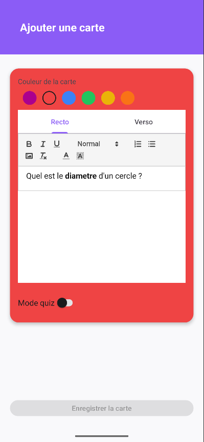
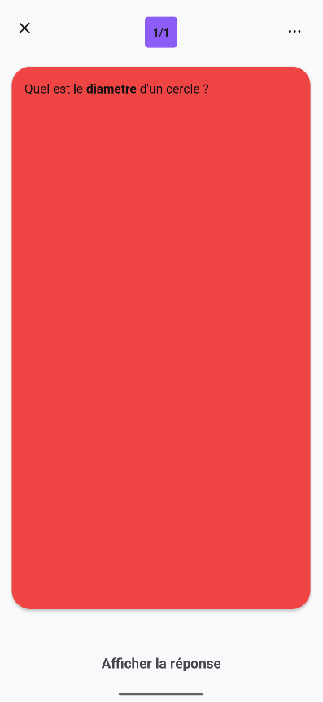
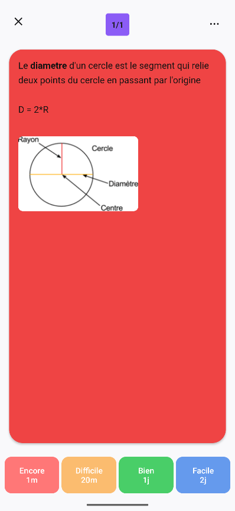

# MemoryFlow
<<<<<<< HEAD
Application favorisant la mémorisation de connaissances à long terme basé sur la méthode de la répétion espacée
=======

**MemoryFlow** est une application android pour mémoriser à long terme ses connaissances basé sur l'apprentissage espacée 

## Qu'est-ce que la répétition espacée ?

C'est une méthode d'apprentissage consistant à répéter des connaissances sur un interval de temps allant de quelques jours à plusieurs mois inspiré par les travaux de [Hermann Ebbinghaus](https://fr.wikipedia.org/wiki/Hermann_Ebbinghaus) qui nous a démontré que plus une information est sollicité sur le long terme plus elle est ancré dans notre mémoire

Courbe de l'oubli

## Comment cette méthode de mémorisation est intégré sur MemoryFlow ?

MemoryFlow vous permet de créer facilement des fiches de révision au format question-réponse.
Lancez des sessions de révision, testez votre capacité à restituer l’information et définissez un délai avant qu’une fiche ne redevienne disponible à l’étude selon votre ressenti.

### 1/Création d'un paquet

Un paquet permet d'organiser vos fiches de révision par thème

### 2/Ajout d'une fiche de révision au paquet

Créez vos fiches de révision selon vos besoins.
Envie de passer au niveau supérieur ? Activez le mode quiz et mettez vos connaissances à l’épreuve

### 3/Session de révision

C’est ici que MemoryFlow prend tout son sens.
Challengez votre mémoire en essayant de restituer vos connaissances.
En fonction de la difficulté rencontrée, vous indiquez à l’algorithme quand planifier votre prochaine session de révision.

>>>>>>> 258236d0d6e61664762e186de42585e3dcb7e22b
